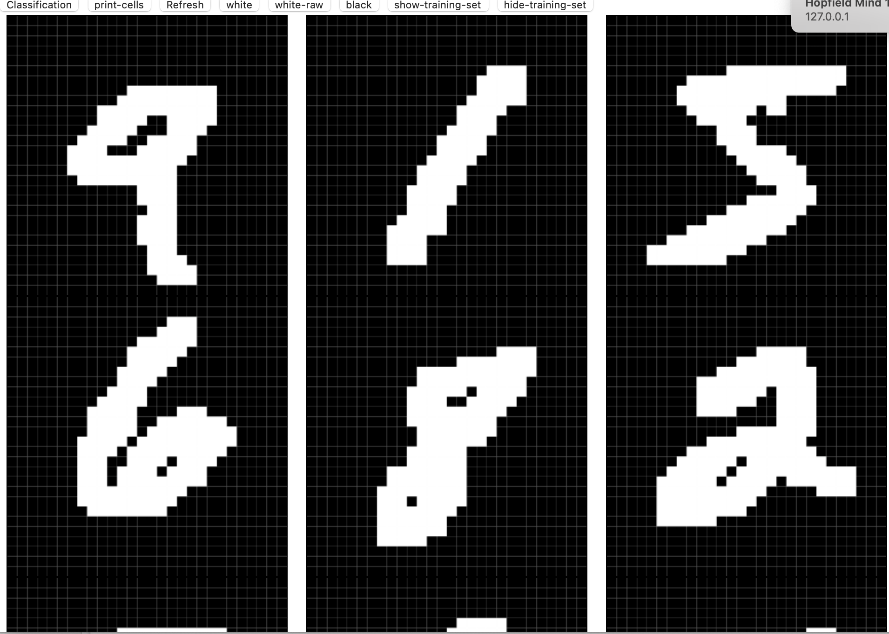
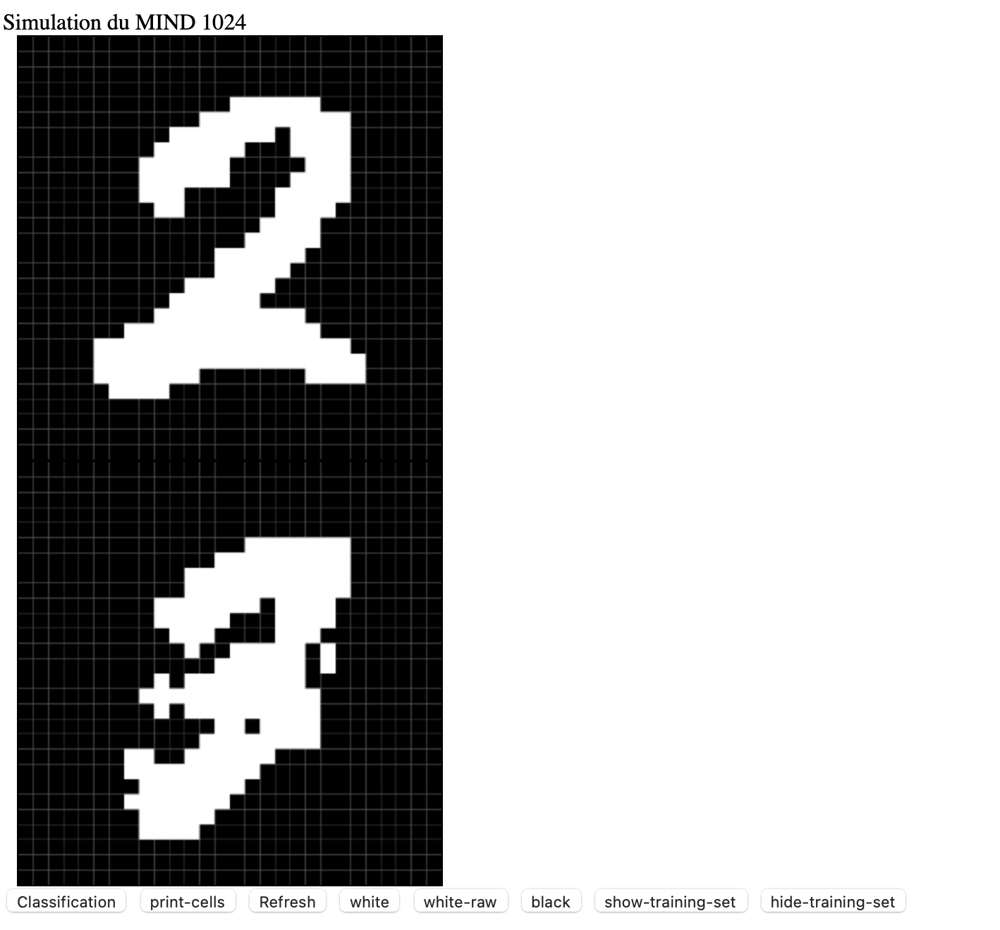

# Simulation d'une machine neuronale mind 1024 
## Introduction : simulation et application
Le but de ce projet étant la simulation d'une machine neuronal MIND 1024, nous avons choisi comme application pour notre simulation une classification des chiffres manuscrit. Nous pourrons ensuite conclure quant aux performances du MIND 1024, ses limites .., mes surtout quant à ce qu'on peut faire avec 1024 neuronnes.
## Simulation du MIND 1024
Pour simuler le MIND 1024, j'ai commencé par la documentation. Malgré  le peu de ressources j'ai décidé de prendre comme point de départ le réseau de Hopfield. 
Un réseau de Hopfield est un réseau de neuronnes sans couches, et où tous les neuronnes sont connectés. Il s'agit d'une mémoire associative qui est utilisée pour retrouver une version non bruitées d'une entrée donnée sur la base de pattern mémorisé par le réseau (entraînement). La capacité d'un réseau de Hopfield est le nombre de pattern qu'on peut mémoriser et elle est fortement liée à son nombre de neuronnes (109 patterns pour 1024 neuronnes). 
## Data
Pour le moment, on utilise 784 neuronnes, 28*28 pixels pour les images. la capacité théorique du réseau est de 80.
On utilisera alors MNIST dataset comme training set et peut-être même pour évaluer les performances du modèle.
En cliquant sur le bouton "show-training-set" on obtient ceci : 

Remarque : si plus tard on souhaite utiliser moins de neuronnes, donc moins de pixels pour nos images. On pourra se tourner vers [sklearn.datasets.load_digits](https://scikit-learn.org/stable/modules/generated/sklearn.datasets.load_digits.html) (size 8x8)
## Avancement 
#### 1er problème : 
Le réseau ne converge vers aucun des patterns
#### 2eme problème :
pour NUMBER_DIGITS = 10, on obtient des résultats de classifications très mauvais.

#### 3eme problème :
Ce dernier peut être résolu si on a convergence vers les patterns (ce qui devrait être le cas dans un réseau de Hopfield, sauf spurious states), le problème est d'afficher comme output le label, et pas le pattern après classification.
## Ressources
[hopfield_mnist](https://github.com/kencyke/hopfield-mnist) est une belle tentative. A utiliser pour comparer à mes résultats

